# agi.diy

[](LICENSE)
[](https://github.com/strands-agents/sdk-typescript)
[](#privacy)

**Build your own AGI. In your browser. Right now.**

[▶️ Launch](https://agi.diy) • [📖 SDK](https://github.com/strands-agents/sdk-typescript) • [📱 Install](#install)

---

## What is this?

> **One sentence:** An AI assistant that runs entirely in your browser, can create its own tools, and keeps thinking even when you walk away.

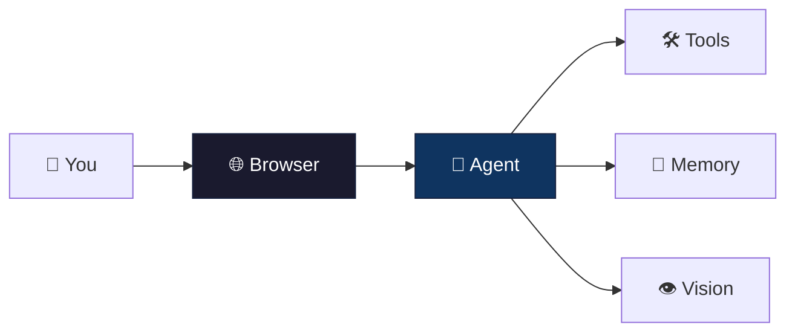

**Nothing leaves your browser.** Your API keys, conversations, and custom tools stay on your device.

---

## How It Works

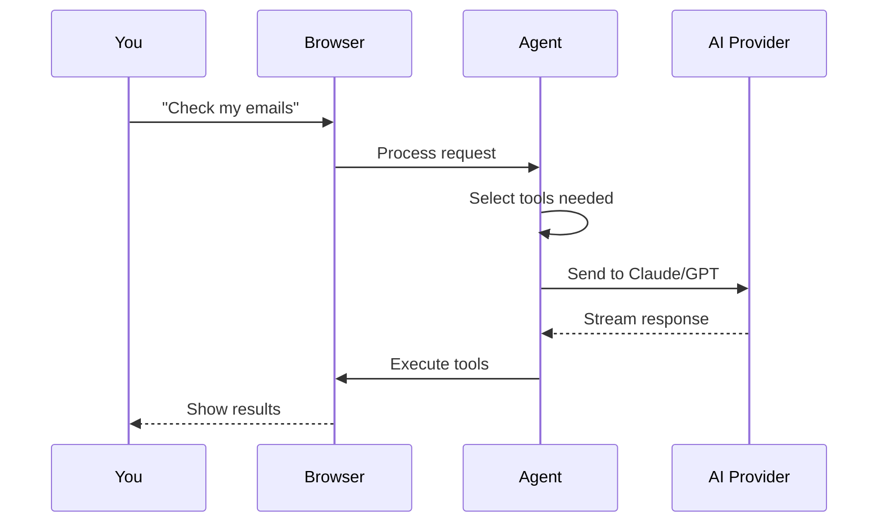

**The flow:**
1. You type a message
2. Agent figures out what tools to use
3. Calls AI provider (or local model)
4. Executes tools in your browser
5. Shows you the result

---

## Quick Start

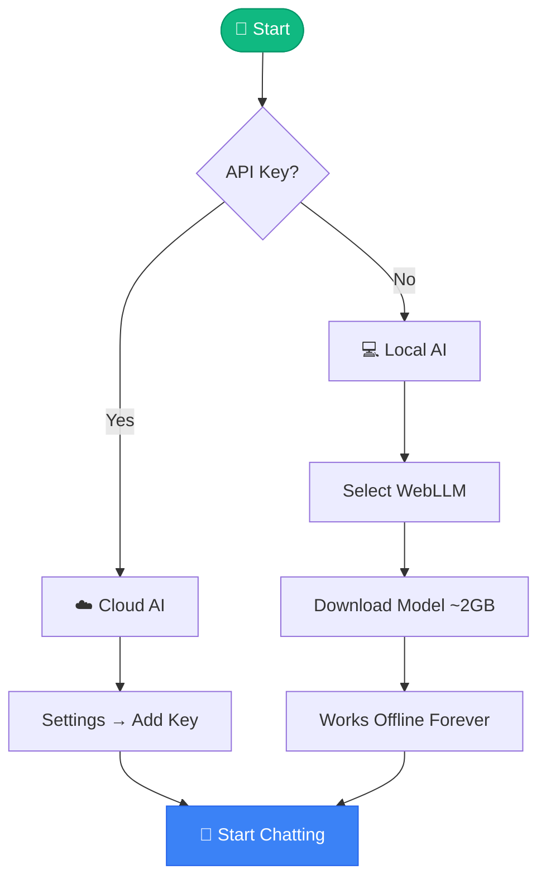

**Three commands:**
```bash
# Option 1: Use hosted version
open https://agi.diy

# Option 2: Self-host
git clone https://github.com/cagataycali/agi-diy.git
cd agi-diy/docs
python3 -m http.server 8080
```

---

## Two Modes Explained

### Single Agent Mode (`index.html`)

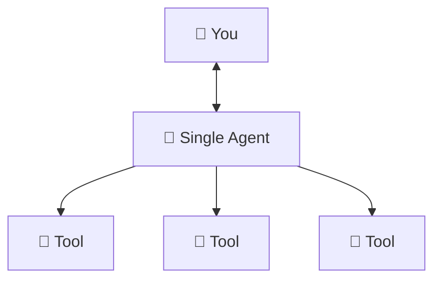

**Like having one smart assistant** who can do many things.

### Multi-Agent Mode (`agi.html`)

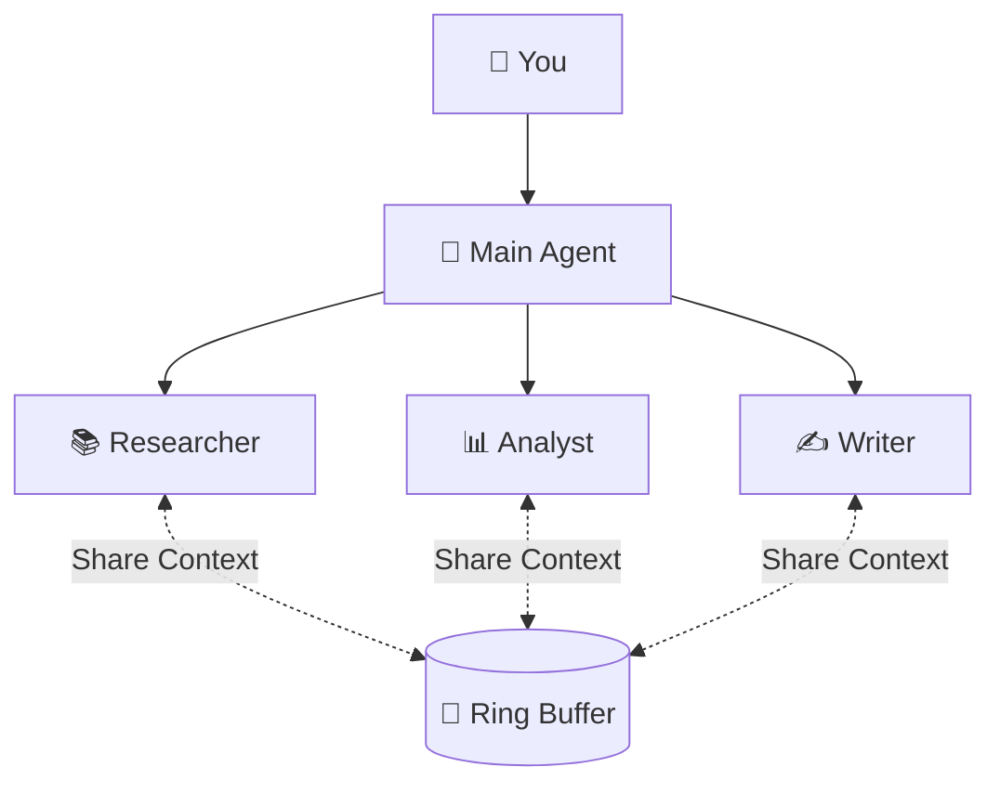

**Like having a team.** Agents share what they learn through "ring attention" - when one discovers something, others see it too.

---

## The Tool System

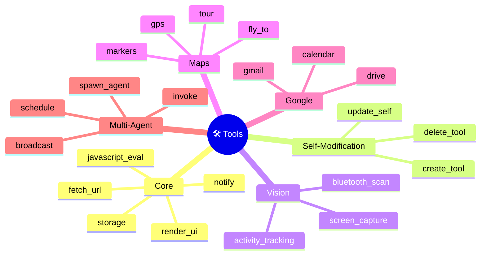

### How Tool Creation Works

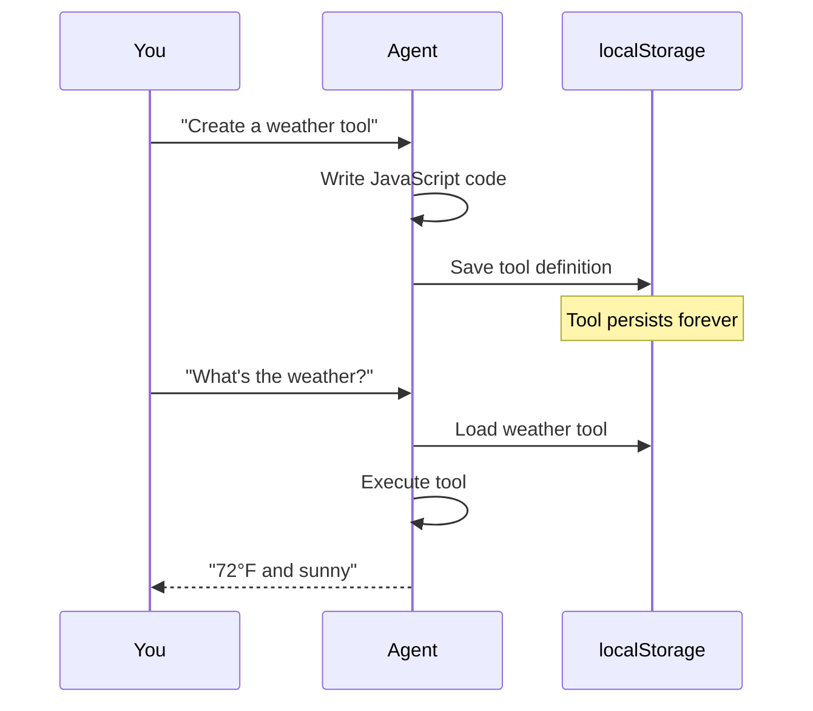

**Tools you create stick around.** Close the browser, come back next week - your tools are still there.

---

## Ambient Mode: Background Thinking

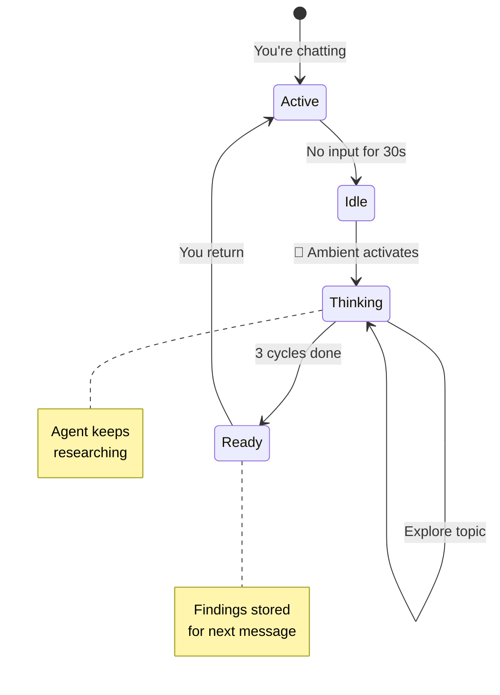

**Think of it like this:** You ask about quantum computing, then go make coffee. When you come back, the agent has already explored related topics and will include those findings in your next conversation.

### Two Ambient Modes

| Mode | Icon | What happens |
|------|------|--------------|
| **Standard** 🌙 | Moon | Thinks 3 times when you're idle, then waits |
| **Autonomous** 🚀 | Rocket | Keeps going until it decides it's done |

---

## Model Options

### Decision Tree: Which Model?

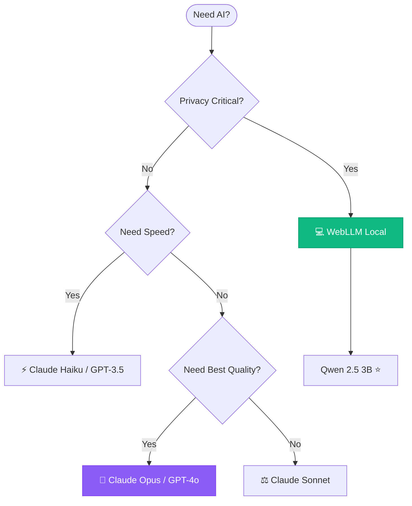

### Model Comparison

| Model | Speed | Quality | Privacy | Cost |
|-------|-------|---------|---------|------|
| **Claude Opus** | 🐢 | ⭐⭐⭐⭐⭐ | ☁️ Cloud | $$$ |
| **Claude Sonnet** | 🐇 | ⭐⭐⭐⭐ | ☁️ Cloud | $$ |
| **Claude Haiku** | 🚀 | ⭐⭐⭐ | ☁️ Cloud | $ |
| **GPT-4o** | 🐇 | ⭐⭐⭐⭐ | ☁️ Cloud | $$ |
| **WebLLM Qwen 3B** | 🐇 | ⭐⭐⭐ | 🔒 Local | Free |
| **WebLLM Qwen 1.5B** | 🚀 | ⭐⭐ | 🔒 Local | Free |

---

## Real Examples

### Example 1: Email Assistant

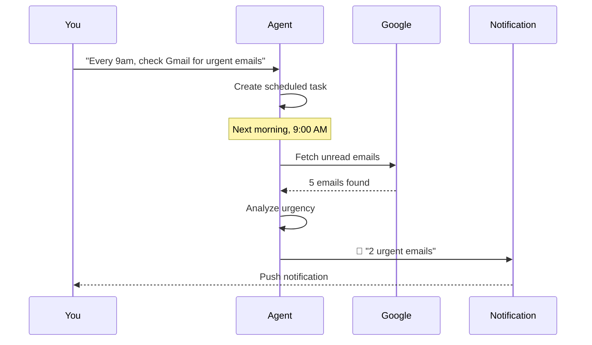

### Example 2: Research Team

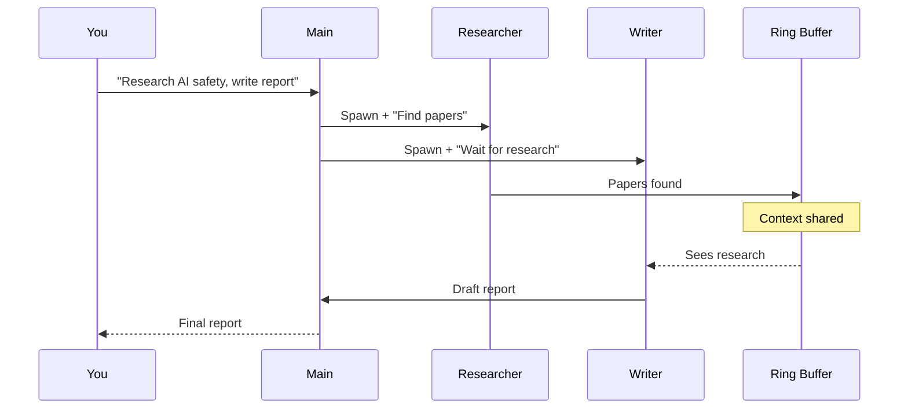

### Example 3: Custom Tool Creation

```
You: "Create a tool that gets cryptocurrency prices"

Agent thinks: I'll use the CoinGecko API...

Agent creates:
┌─────────────────────────────────────┐
│ Tool: crypto_price                  │
│ Input: { coin: "bitcoin" }          │
│ Output: { price: 45000, change: 2%} │
└─────────────────────────────────────┘

Tool saved to localStorage ✓

You: "What's the crypto_price of ethereum?"
Agent: "Ethereum is $3,421 (+1.5% today)"
```

---

## Architecture

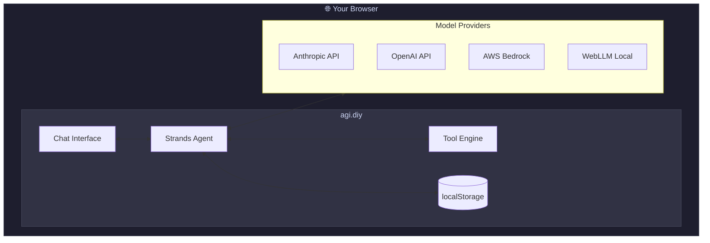

**Key insight:** Everything happens in your browser. The only external calls are to the AI provider you choose (or none, with WebLLM).

---

## Privacy Model

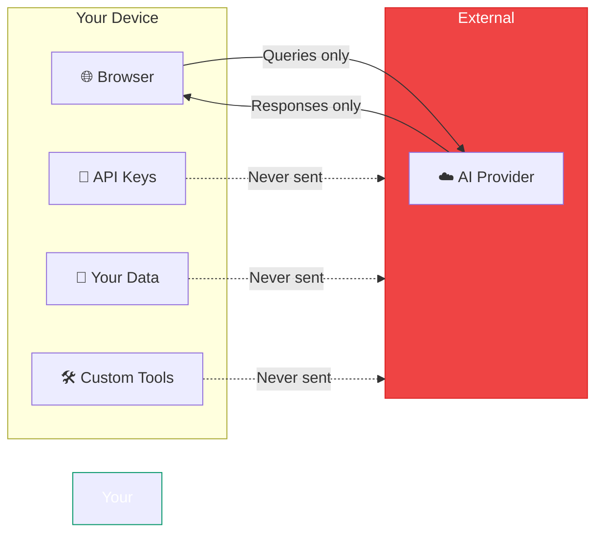

| What | Where it stays |
|------|----------------|
| API Keys | Your browser's localStorage |
| Conversations | Your browser's localStorage |
| Custom Tools | Your browser's localStorage |
| Settings | Your browser's localStorage |

**With WebLLM:** Even queries stay local. Zero external calls.

---

## Installation

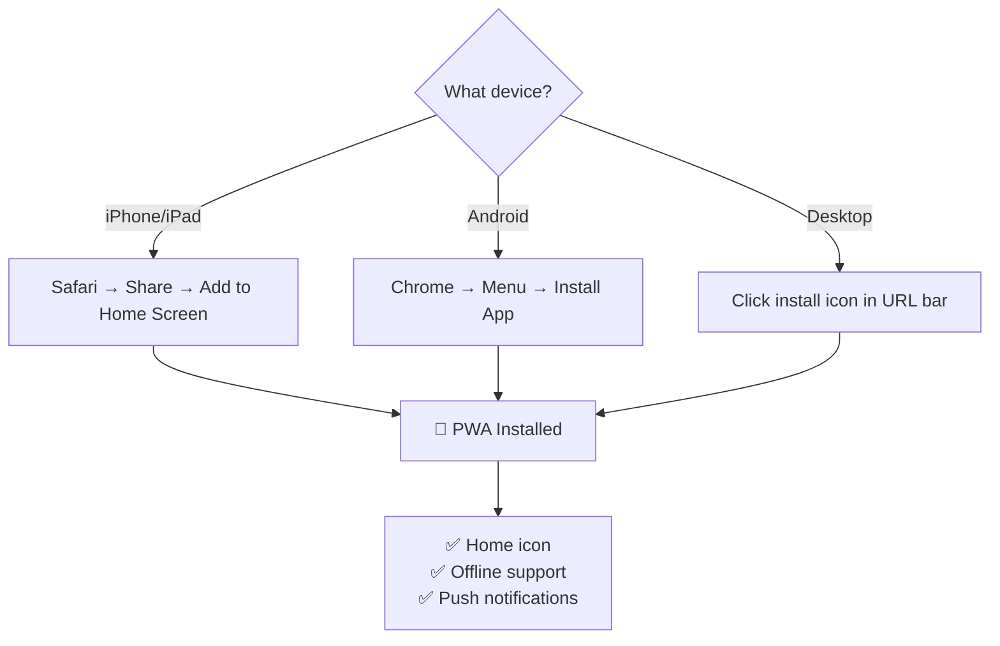

### Sync Between Devices

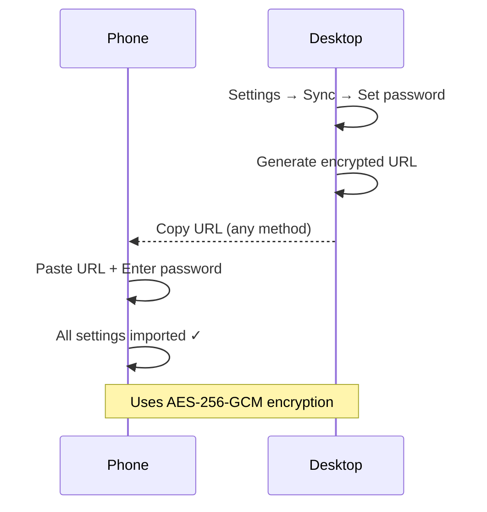

---

## Configuration Cheat Sheet

### API Keys
| Provider | Where to get |
|----------|--------------|
| Anthropic | [console.anthropic.com](https://console.anthropic.com) |
| OpenAI | [platform.openai.com](https://platform.openai.com) |
| Bedrock | [AWS Console](https://console.aws.amazon.com/bedrock) → API Keys |

### Extended Thinking (Bedrock)
```json
{
  "thinking": { 
    "type": "enabled", 
    "budget_tokens": 10000 
  }
}
```

### Google OAuth Setup
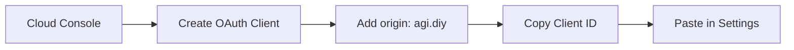

---

## Console Commands

```javascript
// Quick reference
agi.agent           // Get agent instance
agi.clear()         // Clear conversation
agi.tools.list()    // See your custom tools
agi.tools.delete(x) // Remove a tool

// Context
agiContext.getContext()      // What agent knows about you
agiContext.scanBluetooth()   // Find nearby devices
```

---

## Troubleshooting

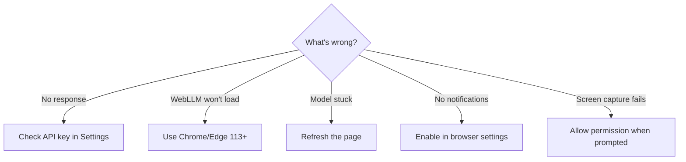

---

## File Structure

```
docs/
├── index.html      # Single agent mode
├── agi.html        # Multi-agent mode
├── strands.js      # Strands SDK
├── vision.js       # Screen capture, ambient mode
├── webllm.js       # Local model inference
├── map.js          # Google Maps integration
├── tools/
│   └── google.js   # Gmail, Drive, Calendar
├── sw.js           # Service worker (PWA)
└── manifest.json   # PWA config
```

---

## Contributing

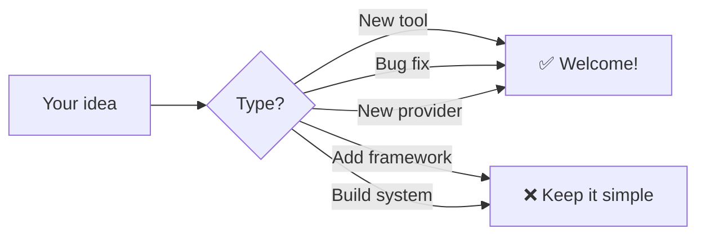

---

## License

Apache 2.0 - Do whatever you want, just include the license.

---

<p align="center">
Built with <a href="https://github.com/strands-agents/sdk-typescript">Strands Agents SDK</a><br/>
<strong><a href="https://agi.diy">agi.diy</a></strong>
</p>
